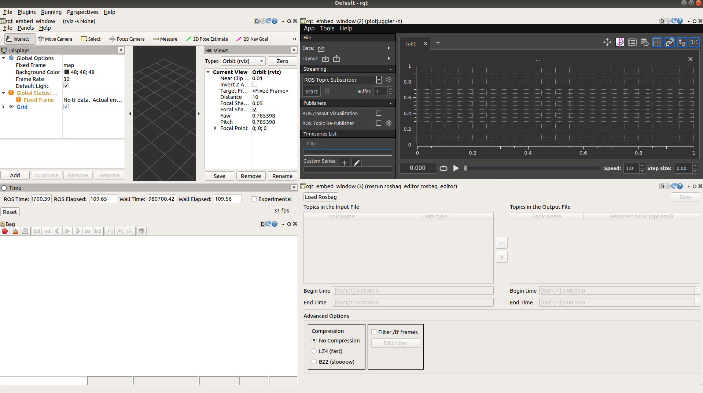
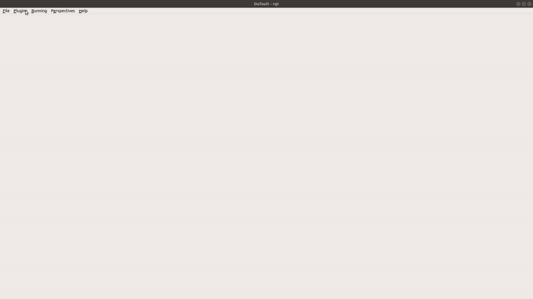

# rqt_embed_window

Embed any graphical program window into a rqt_ plugin. The ultimate productivy tool!

Notable examples of applications that are embeddable with `rqt_embed_window`:

* [Plotjuggler](https://www.plotjuggler.io) Saving some efforts to awesome [@facontidavide](https://github.com/facontidavide) to be able to use it alongside [Rviz](https://github.com/facontidavide/PlotJuggler/issues/87)/[Rqt](https://github.com/facontidavide/PlotJuggler/issues/5)
* [Rviz](http://wiki.ros.org/rviz) Works without crashes unlike [rqt_rviz](http://wiki.ros.org/rqt_rviz) [Issue #6](https://github.com/ros-visualization/rqt_rviz/issues/6).
* [rosbag_editor](https://github.com/facontidavide/rosbag_editor)

Other maybe useful or fun ones:
* Google Chrome (if you have an already existing web interface)
* VLC
* Slack
* Wireshark
* SimpleScreenRecorder
* Visual Studio Code
* Some games like Slay the Spire
* Another instance of rqt_gui

# Usage

Open `rosrun rqt_gui rqt_gui`, go to `Plugins` > `Miscellaneous Tools` > `Embed a graphical program window into RQT`.

You'll be prompted for the commandline for the program (which will be executed in the plugin), for example `rviz -s None`.

**Note**: Doing `-s None` disables the splashscreen, which is **necessary** to get the correct PID and Window ID internally.

You can export your perspective and load it later as any other.

# Things that didn't work for me
terminator, gnome-terminal, LibreOffice, kivy-based apps

# How to try if an app works quickly
Use the `test_if_window_can_be_embedded.py` script providing it the PID of the window you want to test.

You can find the PID by means of `ps aux | grep program-name` or `pstree -p` and look for the process that inherits the rest.

You can also use `xwininfo` and click on the window and manually modify the script to use the window id provided.

# Workarounds for complex commands/programs
If your program needs a long set of parameters or environment variables, set it up in a bash
script and call it from rqt_embed_window, however, you must make sure to prepend the binary with `exec` so the PID reported to rqt_embed_window is the actual PID of the program itself and not the
shell that is executing it.